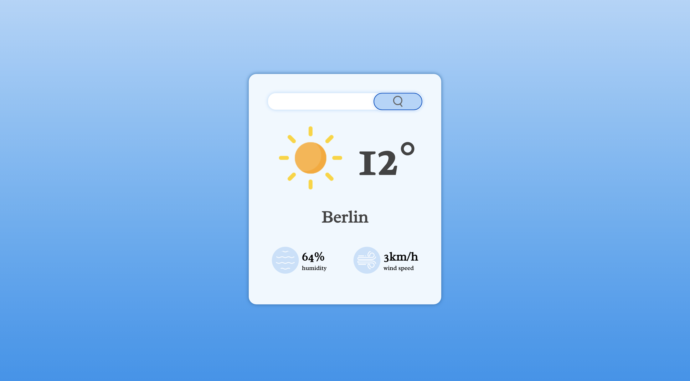

<h1 align="center">

<br>
Weather app
<br>
</h1>
<h4 align="center">A minimalistic JavaScript Weather App</h4>



## Run the App

In the project directory, you can run: 
```sh
open index.html
```

## Information about the project

Weather app is a simple tool for showing the current weather all around the world. By typing the name of the country or city in a searchbar you can see the temperature, humidity and wind speed in given location. This project might be useful if you are searching for current data regarding weather in specific location.

## This project was built with:
* JavaScript
* HTML
* CSS
* OpenWeatherMap API

